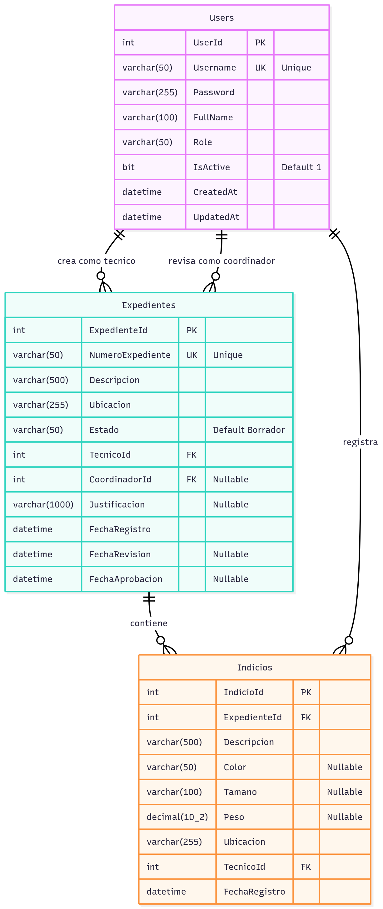

# Sistema DICRI - Dirección de Investigación Criminalística

Sistema de gestión de expedientes e indicios para el Ministerio Público de Guatemala.

## Arquitectura del Sistema

### Estructura del Proyecto
```
dicri-system/
├── backend/                 # API REST con Node.js
│   ├── server.js            # Servidor principal Express
│   └── src/
│       ├── config/          # Configuración de base de datos
│       ├── controllers/     # Lógica de negocio
│       ├── middleware/      # Autenticación JWT y validación
│       ├── routes/          # Definición de endpoints
│       └── utils/           # Helpers para stored procedures
├── frontend/                # Aplicación web con Next.js
│   └── src/app/
│       ├── dashboard/       # Panel principal
│       ├── expedientes/     # Gestión de expedientes
│       ├── revision/        # Aprobación/rechazo
│       ├── reportes/        # Estadísticas y reportes
│       └── lib/api.js       # Cliente API
├── db/                      # Scripts SQL Server
│   ├── schema.sql          # Estructura de tablas
│   ├── seed.sql            # Datos iniciales
│   └── sp_*.sql            # Procedimientos almacenados
└── docker-compose.yml       # Orquestación de contenedores
```

### Diagrama arquitectura


## Tecnologías Utilizadas

- Frontend: Next.js 16, React 19, TailwindCSS
- Backend: Node.js, Express 4, JWT
- Base de Datos: SQL Server 2019
- Contenedores: Docker, Docker Compose

## Instalación y Ejecución

### Requisitos 
- Docker 
- Git

### Pasos de Instalación

1. Clonar el repositorio
```bash
git clone https://github.com/G2309/dicri_pt.git
cd dicri_pt
```

2. Crear archivo de contraseña

Coloca una contraseña segura y ejecuta:

```bash
mkdir secrets
echo "contraseñaSegura123" > secrets/sa_password.txt
```

3. Iniciar contenedores
```bash
docker-compose up --build
```

4. Acceder al sistema
- Frontend: http://localhost:3000
- API: http://localhost:4000/api
- Base de datos: localhost:1433

### Usuarios de Prueba

| Usuario | Contraseña | Rol |
|---------|-----------|-----|
| admin | admin123 | Administrador |
| coordinador1 | coord123 | Coordinador |
| tecnico1 | tecnico123 | Técnico |
| tecnico2 | tecnico123 | Técnico |

## Funcionalidades Principales

### Gestión de Expedientes
- Crear nuevos expedientes con datos generales
- Registrar múltiples indicios por expediente
- Control de estados: Borrador, En Revisión, Aprobado, Rechazado

### Proceso de Revisión
- Los técnicos registran expedientes e indicios
- Envío a revisión cuando está completo
- Coordinadores aprueban o rechazan con justificación

### Reportes y Estadísticas
- Filtros por fecha y estado
- Exportación a CSV
- Dashboard con métricas en tiempo real

## API Endpoints

### Autenticación
- POST /api/auth/login - Inicio de sesión
- GET /api/auth/me - Usuario actual

### Expedientes
- GET /api/expedientes - Listar expedientes
- POST /api/expedientes - Crear expediente
- GET /api/expedientes/:id - Detalle de expediente
- PUT /api/expedientes/:id - Actualizar expediente
- POST /api/expedientes/:id/revision - Enviar a revisión

### Indicios
- GET /api/expedientes/:id/indicios - Listar indicios
- POST /api/expedientes/:id/indicios - Crear indicio
- PUT /api/expedientes/indicios/:id - Actualizar indicio
- DELETE /api/expedientes/indicios/:id - Eliminar indicio

### Revisión
- GET /api/revision/pendientes - Expedientes pendientes
- POST /api/revision/:id/aprobar - Aprobar expediente
- POST /api/revision/:id/rechazar - Rechazar expediente

### Reportes
- GET /api/reportes/registros - Registros con filtros
- GET /api/reportes/estadisticas - Estadísticas generales

## Modelo de Base de Datos

### Tablas Principales

Users: Almacena usuarios del sistema
- UserId (PK)
- Username, Password, FullName, Role
- IsActive, CreatedAt, UpdatedAt

Expedientes: Registros principales
- ExpedienteId (PK)
- NumeroExpediente, Descripcion, Ubicacion
- Estado, TecnicoId (FK), CoordinadorId (FK)
- Justificacion, FechaRegistro, FechaRevision, FechaAprobacion

Indicios: Evidencias por expediente
- IndicioId (PK)
- ExpedienteId (FK), TecnicoId (FK)
- Descripcion, Color, Tamano, Peso, Ubicacion
- FechaRegistro

### Diagrama Entidad Relacion - Mermaid



## Seguridad

- Autenticación mediante JWT con expiración 8 horas
- Passwords almacenados en texto plano (solo para demo)
- Control de acceso basado en roles
- Validación de datos en backend

## Pruebas

### Postman
Importar colección DICRI_API.postman_collection.json
1. Ejecutar Login primero
2. El token se guarda automáticamente
3. Probar endpoints según rol

